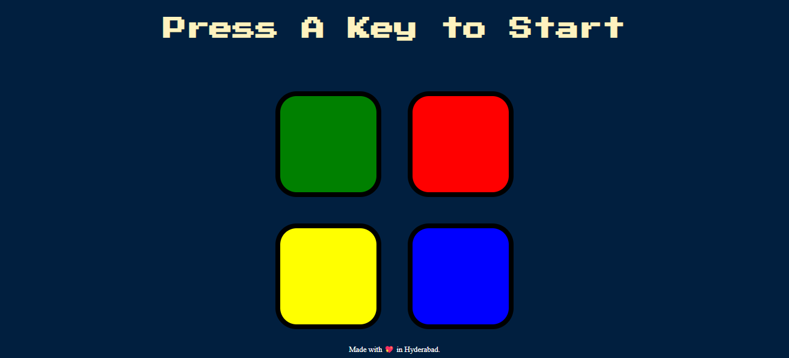

## Simon game

This game is the online version of the Simon electronic game with its circular design and its 4 big illuminated buttons: red, green, blue and yellow. Each key is linked to an electronic sound which will help the player to memorize the series of illuminated keys. You will love this memory game!!

check out the code and feel free to contribute,Let this project grow!!

Using colored blocks, lights, and sounds as directional prompts, the Simon game engages cognitive function that works on sequential processing, short-term memory, attention and visual processing.

#Preview

